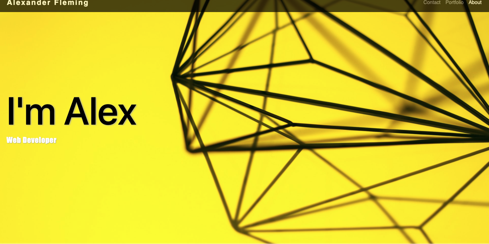
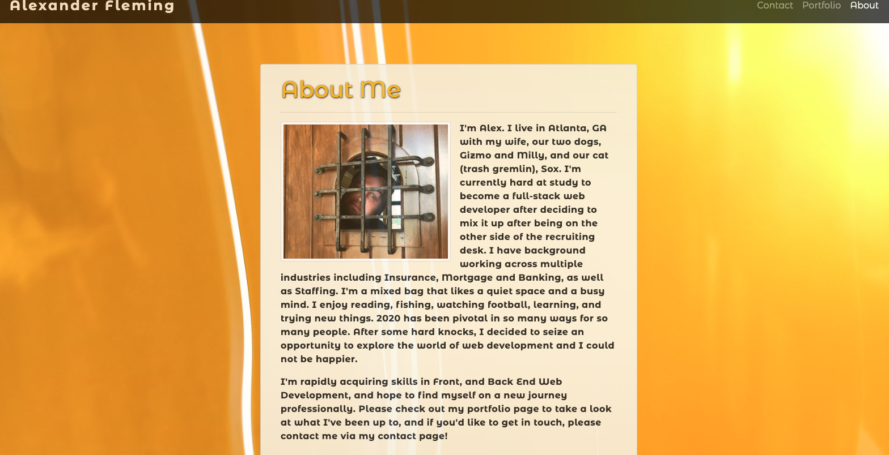
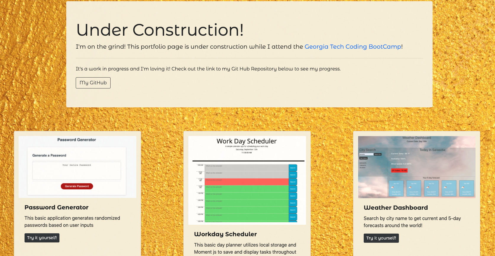
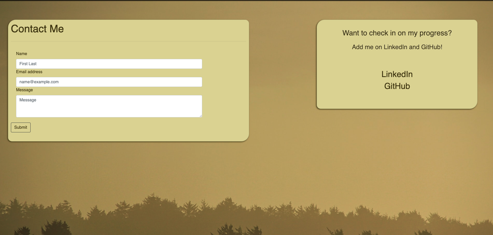

# updated-portfolio

This project is a refactoring of our original Bootstrap portfolio replication page. I took this opportunity to add a few personal touches, portfolio pieces as well as links to my LinkedIn and GitHub. While this portfolio is closer to representing me as a person and a professional, I will continue to refine it until it is polished and interesting. 

For the time being, I took the opportunity to try my hand at some thematic color styling, and am fairly happy with the results. I also took advantages of media queries to do some interesting things on my landing page. 

## Credits 
This project was completed alone and represents an attempt toward a site more representative of my personal style. It's a step in the right direction, but still needs plenty of work. 

## Images
Please find screenshots of my portfolio pages below

#### Landing Page

#### About Me Page

#### Portfolio Page

#### Contact Page

#### Demo

## Links

#### Webpage 
[Portfolio](https://ad-fleming.github.io/updated-portfolio/)

#### Repository
[My Repository](https://github.com/ad-fleming/updated-portfolio)
